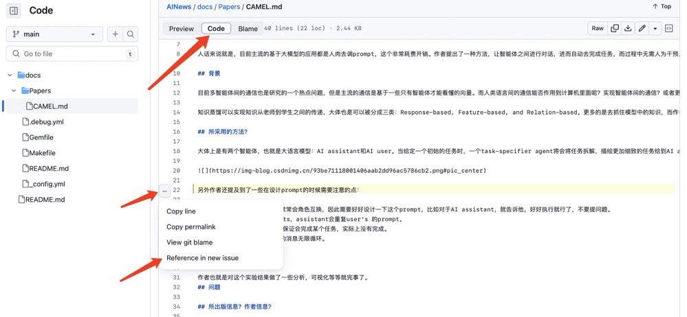

# AINews

## Paper to read

- Ge Y, Hua W, Ji J, et al. **OpenAGI: When LLM Meets Domain Experts**[J]. arXiv preprint arXiv:2304.04370, 2023. [**[Paper Link]**](https://arxiv.org/abs/2304.04370)

- Bolya D, Fu C Y, Dai X, et al. **Hydra attention: Efficient attention with many heads**[C]//Computer Vision–ECCV 2022 Workshops: Tel Aviv, Israel, October 23–27, 2022, Proceedings, Part VII. Cham: Springer Nature Switzerland, 2023: 35-49. [**[Paper Link]**](https://arxiv.org/abs/2209.07484)

- Liu S, Lever G, Wang Z, et al. **From motor control to team play in simulated humanoid football**[J]. arXiv preprint arXiv:2105.12196, 2021. [**[Paper Link]**](https://arxiv.org/abs/2105.12196)

- Liu J, Hallinan S, Lu X, et al. **Rainier: Reinforced knowledge introspector for commonsense question answering**[J]. arXiv preprint arXiv:2210.03078, 2022. [**[Paper Link]**](https://arxiv.org/pdf/2210.03078.pdf)

- Lu S, Liu B, Mills K G, et al. **R5: Rule discovery with reinforced and recurrent relational reasoning**[J]. arXiv preprint arXiv:2205.06454, 2022. [**[Paper Link]**](https://arxiv.org/pdf/2205.06454.pdf)

- Lindner D, Krause A, Ramponi G. **Active Exploration for Inverse Reinforcement Learning**[J]. arXiv preprint arXiv:2207.08645, 2022. [**[Paper Link]**](https://arxiv.org/pdf/2210.13455.pdf)

- Kuba J G, Feng X, Ding S, et al. **Heterogeneous-agent mirror learning: A continuum of solutions to cooperative marl**[J]. arXiv preprint arXiv:2208.01682, 2022. [**[Paper Link]**](https://arxiv.org/pdf/2208.01682.pdf)

- Kapturowski S, Campos V, Jiang R, et al. **Human-level Atari 200x faster**[J]. arXiv preprint arXiv:2209.07550, 2022. [**[Paper Link]**](https://arxiv.org/pdf/2209.07550.pdf)

- Dalal G, Hallak A, Mannor S, et al. **SoftTreeMax: Policy Gradient with Tree Search**[J]. arXiv preprint arXiv:2209.13966, 2022. [**[Paper Link]**](https://arxiv.org/pdf/2209.13966.pdf)

- Laskin M, Wang L, Oh J, et al. **In-context reinforcement learning with algorithm distillation**[J]. arXiv preprint arXiv:2210.14215, 2022. [**[Paper Link]**](https://arxiv.org/pdf/2210.14215.pdf)

- Yu T, Zhang Z, Lan C, et al. **Mask-based latent reconstruction for reinforcement learning**[J]. Advances in Neural Information Processing Systems, 2022, 35: 25117-25131. [**[Paper Link]**](https://arxiv.org/pdf/2201.12096.pdf)

- Ding T, Graesser L, Abeyruwan S W, et al. **Goalseye: Learning high speed precision table tennis on a physical robot**[J]. 2022. [**[Paper Link]**](https://arxiv.org/pdf/2210.03662.pdf)

- Chen E, Hong Z W, Pajarinen J, et al. **Redeeming intrinsic rewards via constrained optimization**[J]. arXiv preprint arXiv:2211.07627, 2022. [**[Paper Link]**](https://arxiv.org/pdf/2211.07627.pdf)

- Meta Fundamental AI Research Diplomacy Team (FAIR)†, Bakhtin A, Brown N, et al. **Human-level play in the game of Diplomacy by combining language models with strategic reasoning**[J]. Science, 2022, 378(6624): 1067-1074. [**[Paper Link]**](https://www.science.org/doi/10.1126/science.ade9097)

- Mai V, Mani K, Paull L. **Sample efficient deep reinforcement learning via uncertainty estimation**[J]. arXiv preprint arXiv:2201.01666, 2022. [**[Paper Link]**](https://arxiv.org/pdf/2201.01666.pdf)

- Ardon L. **Reinforcement Learning to Solve NP-hard Problems: an Application to the CVRP**[J]. arXiv preprint arXiv:2201.05393, 2022. [**[Paper Link]**](https://arxiv.org/pdf/2201.05393.pdf)

- Li G, Wu J, He Y. **ActorRL: A Novel Distributed Reinforcement Learning for Autonomous Intersection Management**[J]. arXiv preprint arXiv:2205.02428, 2022. [**[Paper Link]**](https://arxiv.org/pdf/2205.02428.pdf)

- Ramamurthy R, Ammanabrolu P, Brantley K, et al. **Is Reinforcement Learning (Not) for Natural Language Processing?: Benchmarks, Baselines, and Building Blocks for Natural Language Policy Optimization**[J]. arXiv preprint arXiv:2210.01241, 2022. [**[Paper Link]**](https://openreview.net/pdf?id=8aHzds2uUyB)

- Wang Z, Hunt J J, Zhou M. **Diffusion policies as an expressive policy class for offline reinforcement learning**[J]. arXiv preprint arXiv:2208.06193, 2022. [**[Paper Link]**](https://arxiv.org/abs/2208.06193)

- Li W, Luo H, Lin Z, et al. **A Survey on Transformers in Reinforcement Learning**[J]. arXiv preprint arXiv:2301.03044, 2023. [**[Paper Link]**](https://arxiv.org/abs/2301.03044)

- Pinto A S, Kolesnikov A, Shi Y, et al. **Tuning computer vision models with task rewards**[J]. arXiv preprint arXiv:2302.08242, 2023. [**[Paper Link]**](https://arxiv.org/pdf/2302.08242v1.pdf)

- Feng S, Sun H, Yan X, et al. **Dense reinforcement learning for safety validation of autonomous vehicles**[J]. Nature, 2023, 615(7953): 620-627. [**[Paper Link]**](https://www.nature.com/articles/s41586-023-05732-2)

- Lu P, Qiu L, Chang K W, et al. **Dynamic prompt learning via policy gradient for semi-structured mathematical reasoning**[J]. arXiv preprint arXiv:2209.14610, 2022. [**[Paper Link]**](https://arxiv.org/abs/2209.14610)

- Lan Q, Pan Y, Luo J, et al. **Memory-efficient Reinforcement Learning with Value-based Knowledge Consolidation**[J]. Transactions on Machine Learning Research, 2022. [**[Paper Link]**](https://arxiv.org/abs/2205.10868)

- Yuan H, Zhang C, Wang H, et al. **Plan4MC: Skill Reinforcement Learning and Planning for Open-World Minecraft Tasks**[J]. arXiv preprint arXiv:2303.16563, 2023. [**[Paper Link]**](https://arxiv.org/abs/2303.16563)

- Muning WEN, Runji LIN, HanjingWANG, Yaodong YANG, Ying WEN, Luo MAI, Jun WANG, Haifeng ZHANG, Weinan ZHANG. **Large Sequence Models for Sequential Decision-Making: A Survey**. Front. [**[Paper Link]**](https://journal.hep.com.cn/fcs/EN/article/downloadArticleFile.do?attachType=PDF&id=34914)

- Haarnoja T, Moran B, Lever G, et al. **Learning Agile Soccer Skills for a Bipedal Robot with Deep Reinforcement Learning**[J]. arXiv preprint arXiv:2304.13653, 2023. [**[Paper Link]**](https://arxiv.org/abs/2304.13653)

- Remedios L W, Cai L Y, Remedios S W, et al. **Exploring shared memory architectures for end-to-end gigapixel deep learning**[J]. arXiv preprint arXiv:2304.12149, 2023. [**[Paper Link]**](https://arxiv.org/abs/2304.12149v1)

- Hansen-Estruch P, Kostrikov I, Janner M, et al. **IDQL: Implicit Q-Learning as an Actor-Critic Method with Diffusion Policies**[J]. arXiv preprint arXiv:2304.10573, 2023. [**[Paper Link]**](https://arxiv.org/abs/2304.10573)

- Yu C, Zheng X, Zhuo H H, et al. **Reinforcement Learning with Knowledge Representation and Reasoning: A Brief Survey**[J]. arXiv preprint arXiv:2304.12090, 2023. [**[Paper Link]**](https://arxiv.org/abs/2304.12090v1)

- Zhou H, Sui A, Shi L. **Penalty-Based Imitation Learning With Cross Semantics Generation Sensor Fusion for Autonomous Driving**[J]. arXiv preprint arXiv:2303.11888, 2023. [**[Paper Link]**](https://arxiv.org/abs/2303.11888v1)

- Chowdhery A, Narang S, Devlin J, et al. **Palm: Scaling language modeling with pathways**[J]. arXiv preprint arXiv:2204.02311, 2022. [**[Paper Link]**](https://arxiv.org/abs/2204.02311)

- Han Y, Razaviyayn M, Xu R. **Policy Gradient Converges to the Globally Optimal Policy for Nearly Linear-Quadratic Regulators**[J]. arXiv preprint arXiv:2303.08431, 2023. [**[Paper Link]**](https://arxiv.org/abs/2303.08431v1)

- Lu C, Schroecker Y, Gu A, et al. **Structured State Space Models for In-Context Reinforcement Learning**[J]. arXiv preprint arXiv:2303.03982, 2023. [**[Paper Link]**](https://arxiv.org/abs/2303.03982)

- Trockman A, Kolter J Z. **Patches are all you need?**[J]. arXiv preprint arXiv:2201.09792, 2022. [**[Paper Link]**](https://openreview.net/forum?id=rAnB7JSMXL)

- Barber D. **Smoothed Q-learning**[J]. arXiv preprint arXiv:2303.08631, 2023. [**[Paper Link]**](https://arxiv.org/abs/2303.08631v1)

- Abbas Z, Zhao R, Modayil J, et al. **Loss of Plasticity in Continual Deep Reinforcement Learning**[J]. arXiv preprint arXiv:2303.07507, 2023. [**[Paper Link]**](https://arxiv.org/abs/2303.07507)

- Nguyen A, Karampatziakis N, Chen W. Meet in the Middle: **A New Pre-training Paradigm**[J]. arXiv preprint arXiv:2303.07295, 2023. [**[Paper Link]**](https://arxiv.org/abs/2303.07295).

- Wei C, Wang Y C, Wang B, et al. **An Overview on Language Models: Recent Developments and Outlook**[J]. arXiv preprint arXiv:2303.05759, 2023. [**[Paper Link]**](https://arxiv.org/abs/2303.05759).
 
- Introducing a framework to create AI agents that can understand human instructions and perform actions in open-ended settings [[blog link]](https://www.deepmind.com/blog/building-interactive-agents-in-video-game-worlds)

- Jiang M, Rocktäschel T, Grefenstette E. **General Intelligence Requires Rethinking Exploration**[J]. arXiv preprint arXiv:2211.07819, 2022. [**[Paper Link]**](https://arxiv.org/abs/2211.07819).

- Korbak T, Perez E, Buckley C L. **RL with KL penalties is better viewed as Bayesian inference**[J]. arXiv preprint arXiv:2205.11275, 2022. [**[Paper Link]**](https://arxiv.org/pdf/2205.11275.pdf).

- Gupta A, Pacchiano A, Zhai Y, et al. **Unpacking reward shaping: Understanding the benefits of reward engineering on sample complexity**[J]. Advances in Neural Information Processing Systems, 2022, 35: 15281-15295. [**[Paper Link]**](https://arxiv.org/abs/2210.09579).

- Gehring J, Gopinath D, Won J, et al. **Leveraging Demonstrations with Latent Space Priors**[J]. arXiv preprint arXiv:2210.14685, 2022. [**[Paper Link]**](https://facebookresearch.github.io/latent-space-priors/).

- Gilbert T K, Dean S, Lambert N, et al.**Reward reports for reinforcement learning**[J]. arXiv preprint arXiv:2204.10817, 2022. [**[Paper Link]**](https://arxiv.org/abs/2204.10817).

- Fernandes P, Madaan A, Liu E, et al. **Bridging the Gap: A Survey on Integrating (Human) Feedback for Natural Language Generation**[J]. arXiv preprint arXiv:2305.00955, 2023. [**[Paper Link]**](https://arxiv.org/abs/2305.00955).

- Yang S, Nachum O, Du Y, et al. **Foundation Models for Decision Making: Problems, Methods, and Opportunities**[J]. arXiv preprint arXiv:2303.04129, 2023. [**[Paper Link]**](https://arxiv.org/pdf/2303.04129.pdf).

- Christiano P F, Leike J, Brown T, et al. **Deep reinforcement learning from human preferences**[J]. Advances in neural information processing systems, 2017, 30. [**[Paper Link]**](https://proceedings.neurips.cc/paper/2017/file/d5e2c0adad503c91f91df240d0cd4e49-Paper.pdf).

- Ziegler D M, Stiennon N, Wu J, et al. **Fine-tuning language models from human preferences**[J]. arXiv preprint arXiv:1909.08593, 2019.[**[Paper Link]**](https://arxiv.org/pdf/1909.08593.pdf)

- Ouyang L, Wu J, Jiang X, et al. **Training language models to follow instructions with human feedback**[J]. Advances in Neural Information Processing Systems, 2022, 35: 27730-27744.[**[Paper Link]**](https://proceedings.neurips.cc/paper_files/paper/2022/file/b1efde53be364a73914f58805a001731-Paper-Conference.pdf)

- Stiennon N, Ouyang L, Wu J, et al. **Learning to summarize with human feedback**[J]. Advances in Neural Information Processing Systems, 2020, 33: 3008-3021.[**[Paper Link]**](https://arxiv.org/pdf/2009.01325.pdf)

- Bai Y, Jones A, Ndousse K, et al. **Training a helpful and harmless assistant with reinforcement learning from human feedback**[J]. arXiv preprint arXiv:2204.05862, 2022.[**[Paper Link]**](https://arxiv.org/pdf/2204.05862)

- Nakano R, Hilton J, Balaji S, et al. **Webgpt: Browser-assisted question-answering with human feedback**[J]. arXiv preprint arXiv:2112.09332, 2021.[**[Paper Link]**](https://arxiv.org/pdf/2112.09332)

- Uesato J, Kushman N, Kumar R, et al. **Solving math word problems with process-and outcome-based feedback**[J]. arXiv preprint arXiv:2211.14275, 2022.[**[Paper Link]**](https://arxiv.org/pdf/2211.14275)

- Deng M, Wang J, Hsieh C P, et al. **Rlprompt: Optimizing discrete text prompts with reinforcement learning**[J]. arXiv preprint arXiv:2205.12548, 2022.[**[Paper Link]**](https://arxiv.org/pdf/2205.12548)

- Carta T, Romac C, Wolf T, et al. **Grounding large language models in interactive environments with online reinforcement learning**[J]. arXiv preprint arXiv:2302.02662, 2023.[**[Paper Link]**](https://arxiv.org/pdf/2302.02662)

- Mezghani L, Bojanowski P, Alahari K, et al. **Think Before You Act: Unified Policy for Interleaving Language Reasoning with Actions**[J]. arXiv preprint arXiv:2304.11063, 2023.[**[Paper Link]**](https://arxiv.org/pdf/2304.11063)

- Ganguli D, Askell A, Schiefer N, et al. **The capacity for moral self-correction in large language models**[J]. arXiv preprint arXiv:2302.07459, 2023. [**[Paper Link]**](https://arxiv.org/abs/2302.07459)

## Paper with Chinese Notes

If you have any incomprehension of the chinese note, you are welcome to submit issue.

- Li G, Hammoud H A A K, Itani H, et al. **CAMEL: Communicative Agents for" Mind" Exploration of Large Scale Language Model Society**[J]. arXiv preprint arXiv:2303.17760, 2023. [**[Paper Link]**](https://ghli.org/camel.pdf). [**[Chinese Note Link]**](./docs/Papers/CAMEL.md).

- **FrugalGPT: How to Use Large Language Models While Reducing Cost and Improving Performance** [**[Paper Link]**](https://arxiv.org/pdf/2305.05176.pdf). [**[Chinese Note Link]**](./docs/Papers/FrugalGPT.md).

